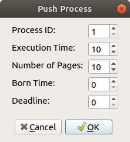
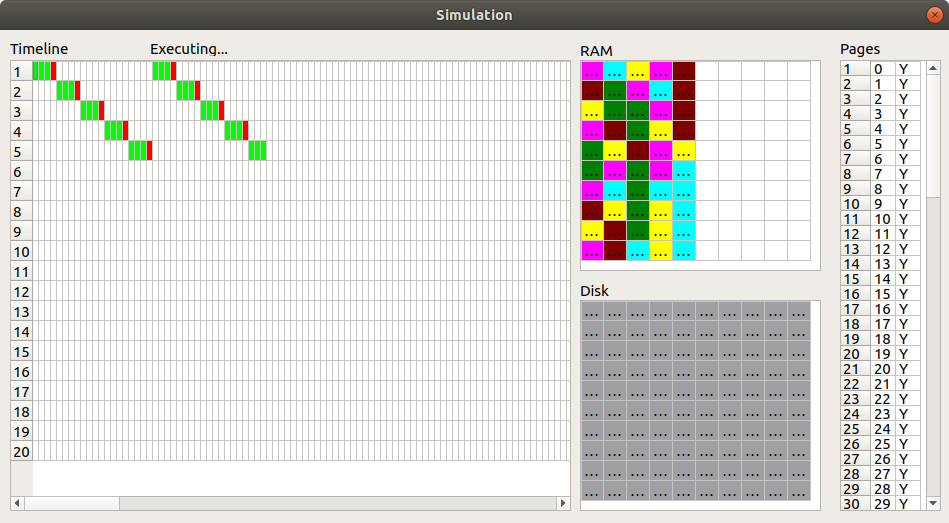

# Operating System Simulator

This is a operating system simulator project for MATA58 at UFBA (Operating Systems). The library was built for the 2018.1 coursework and was subsequently used by the professor as an example for the following classes.

The library currently offers two different memory managers that can be combined with four types of schedulers. It also offers base classes to create other types of tools.

## Building

There are no depencencies beyond a C++17 compiler.

```{bash}
./configure
make
```

It will produce both shared and static library.

## Installing

After building, run:

```{bash}
make install
```

## Example

You can find an application for this lib in `examples`. It's an implementation made by my mates of a simulator using Qt as front end.

### Images





